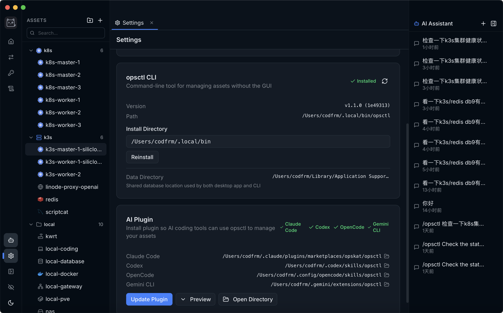

<p align="right">
<a href="./README.md">English</a> | <a href="./README_zh.md">中文</a>
</p>

<h1 align="center">
<br/>
OpsKat
</h1>

<p align="center">An AI-first desktop application for managing remote infrastructure. Describe what you need — the AI agent handles the rest, with policy enforcement and full audit logging.</p>

<p align="center">
<a href="https://opskat.github.io/">Website</a> ·
<a href="https://opskat.github.io/docs/getting-started/installation">Docs</a> ·
<a href="https://github.com/opskat/opskat/releases">Download</a>
</p>

<p align="center">
  
  &nbsp;
  
  &nbsp;
  
  &nbsp;
  
</p>

## About

OpsKat is an **AI-first** desktop application for managing remote infrastructure. Instead of navigating menus and filling forms, describe what you need — the AI agent executes commands, queries, and file transfers on your behalf, with policy enforcement and full audit logging at every step.

It also ships a standalone CLI tool (`opsctl`) sharing the same core, for headless operations and scripting.

**If you find it useful, please give us a Star — it means a lot to us!**

## Demo

https://github.com/opskat/opskat/releases/download/v1.0.0/demo.mp4

## ✨ Core Features

### 🤖 AI Agent

Multi-turn conversations with tool calling. Supports OpenAI-compatible API, Claude CLI, and Codex CLI. The agent can manage assets, run commands, execute queries, transfer files, and more — all routed through the same policy and audit pipeline.

### 🖥️ Asset Management

Organize infrastructure into tree-structured groups. Currently supports SSH servers, MySQL/PostgreSQL databases, and Redis instances, with more asset types planned. Encrypted credential storage with OS keyring integration. Import from SSH config or Tabby; export to file or GitHub Gist.

### 🔌 SSH Terminal

Interactive terminal with split pane, customizable themes, SFTP file browser, jump host chains, connection pooling, port forwarding, and SOCKS proxy.

### 🗄️ Query Editor

SQL editor with result tables (MySQL/PostgreSQL via SSH tunnel), Redis command execution with key browser, and SQL analysis powered by TiDB Parser.

### 🛡️ Policy Enforcement

Allow/deny rules for SSH commands, SQL statements, and Redis operations. Policy group system with built-in templates and user-defined groups.

### 📋 Audit & Approval

Every action is logged with decision tracking. Grant/approval workflow for opsctl with command pattern pre-approval.

### 🌐 i18n

English and Simplified Chinese.

## ⌨️ opsctl CLI

Standalone CLI sharing the same core as the desktop app, for scripting and automation without the GUI. Can be auto-installed from the desktop app with one click.

```bash
opsctl exec <asset> -- <command>    # Execute remote command
opsctl ssh <asset>                  # Interactive SSH session
opsctl cp <src> <dst>               # File transfer (local/remote/cross-server)
opsctl sql <asset> "<query>"        # Execute SQL query
opsctl redis <asset> "<command>"    # Execute Redis command
opsctl list assets|groups           # List assets or groups
opsctl grant submit ...             # Pre-approve command patterns
```

When the desktop app is running, opsctl reuses its connection pool and routes approval through the app's UI.

## 🧩 AI Coding Tool Integration

OpsKat has built-in integration with AI coding CLIs — **Claude Code** and **Codex**. One-click skill installation from the desktop app teaches these AI assistants how to use `opsctl`, so they can directly manage servers, run commands, transfer files, and query databases on your behalf.

<p align="center">
  
</p>

## 🛠️ Tech Stack

| | |
|---------|------------|
| Desktop | [Wails v2](https://wails.io/) (Go + Web) |
| Frontend | React 19 + TypeScript + Tailwind CSS |
| Backend | Go 1.25, SQLite |

## 🚀 Getting Started

**Prerequisites:** [Go 1.25+](https://go.dev/), [Node.js 22+](https://nodejs.org/) with [pnpm](https://pnpm.io/), [Wails v2 CLI](https://wails.io/docs/gettingstarted/installation)

```bash
make install        # Install frontend dependencies
make dev            # Development mode (hot reload)
make build          # Production build
make build-embed    # Production build with embedded opsctl
make build-cli      # Build opsctl CLI only
```

---

## 🤝 Contributing

We welcome all forms of contribution! Check out the issues or submit a pull request.

---

## 📄 License

This project is open-sourced under the [GPLv3](./LICENSE) license.
