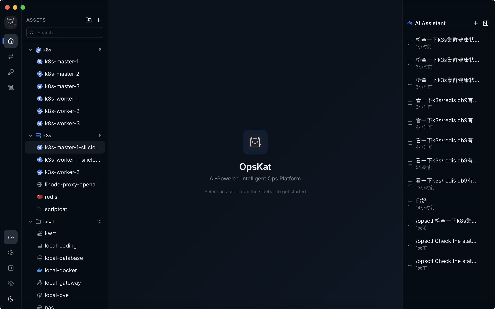

<p align="right">
<a href="./README.md">English</a> | <a href="./README_zh.md">中文</a>
</p>

<h1 align="center">
<br/>
OpsKat
</h1>

<p align="center">开源的 AI 优先桌面运维工具。描述你的需求，AI Agent 代你执行，每一步都有策略管控和完整审计日志。</p>

<p align="center">
<a href="https://opskat.github.io/">官网</a> ·
<a href="https://opskat.github.io/docs/getting-started/installation">文档</a> ·
<a href="https://github.com/opskat/opskat/releases">下载</a>
</p>

<p align="center">
  
  &nbsp;
  
  &nbsp;
  
  &nbsp;
  
</p>

<p align="center">
  
</p>

## 关于

平时操作服务器环境，经常要打开好几个工具来回切换。OpsKat 把常用的资产操作都集成在一起，不用再在好几个工具之间跳了。加上 AI Agent，直接跟它说一句话就能搞定，当然每一步都有策略管控和审计日志。

目前支持管理 SSH 服务器、MySQL/PostgreSQL 数据库、Redis，后续还会考虑使用插件模式集成其它常用运维资产。

**如果觉得有用，求个 Star ⭐ 这是对我们最大的支持！**

## 演示

https://github.com/user-attachments/assets/035fc0df-230c-456b-87bd-8a4a125feaec

## ✨ 实际使用场景

- **"帮我看一下 web-01 上 nginx 最近的错误日志"** → AI 自动 SSH 上去执行命令并返回结果
- **"统计一下 db-prod 上 users 表各 status 的数量"** → AI 通过 SSH 隧道连数据库执行 SQL
- **"检查一下 k3s 集群的健康状况"** → AI 自动跑 kubectl 相关命令，汇总节点和 Pod 状态

## 🛡️ 安全与审计

给 AI 操作服务器的权限，怎么保证安全？

- **操作策略** — SSH 命令、SQL 语句、Redis 操作都支持白名单/黑名单，SQL 还会基于 Parser 自动拦截无 WHERE 的 DELETE/UPDATE 等危险操作
- **策略组** — 内置常用模板（Linux 只读、危险命令拒绝等），也可以自定义
- **预申请权限** — AI 或 opsctl 可以提前申请一批命令的执行权限，用户一次审批后，后续匹配的命令自动放行，不用每条都确认
- **审计日志** — 所有操作自动记录，谁在什么时候对哪台服务器执行了什么命令，决策来源全部可追溯

## 🖥️ 也是个好用的终端和资产管理工具

抛开 AI 部分，OpsKat 本身也是一个功能完整的终端和资产管理工具：

- 树形分组管理 SSH 服务器、数据库、Redis
- 分屏终端，自定义主题
- SFTP 文件浏览器
- 跳板机链式连接
- 数据库查询编辑器（MySQL/PostgreSQL，支持 SSH 隧道）
- Redis 命令执行与 Key 浏览器
- 端口转发、SOCKS 代理
- 凭据加密存储
- 从 SSH config / Tabby 导入

## ⌨️ opsctl CLI + AI 编程工具集成

OpsKat 还提供了独立命令行工具 `opsctl`，主要给 **Claude Code**、**Codex**、**Gemini CLI** 这类 AI 编程助手用。桌面端一键安装 Skill，AI 编程助手就能通过 opsctl 直接管理服务器、查日志、查数据库、排查线上问题。

桌面端运行时，opsctl 会复用桌面端的连接池和审批流程，操作同样受策略管控和审计。

当然也可以自己手动用：

```bash
opsctl exec web-01 -- tail -n 100 /var/log/nginx/error.log
opsctl sql db-prod "SELECT status, COUNT(*) FROM users GROUP BY status"
opsctl ssh web-01
```

## 🛠️ 技术栈

| | |
|---------|------------|
| 桌面端 | [Wails v2](https://wails.io/) (Go + Web) |
| 前端 | React 19 + TypeScript + Tailwind CSS |
| 后端 | Go 1.25、SQLite |

## 🚀 快速开始

**前置依赖：** [Go 1.25+](https://go.dev/)、[Node.js 22+](https://nodejs.org/) + [pnpm](https://pnpm.io/)、[Wails v2 CLI](https://wails.io/docs/gettingstarted/installation)

```bash
make install        # 安装前端依赖
make dev            # 开发模式（热重载）
make build          # 生产构建
make build-embed    # 生产构建（内嵌 opsctl）
make build-cli      # 仅构建 opsctl CLI
```

---

## 🤝 参与贡献

我们欢迎所有形式的贡献！查看 Issues 或提交 Pull Request。

---

## 📄 开源许可

本项目基于 [GPLv3](./LICENSE) 协议开源。

## 🔗 友情链接

- [LINUX DO](https://linux.do/)
